# Write Choose Your Own Adventure Book

Orchestrate the writing of a complete Choose Your Own Adventure book by coordinating page writes through subagents.

## Arguments

This skill expects arguments in the format:
```
/write-adventure <input-dir> <output-dir>
```

- `<input-dir>`: Directory containing `summary.yaml` and `outline.json`
- `<output-dir>`: Directory where page files will be written

Example: `/write-adventure number-3/input number-3/output`

## Process

### 1. Read Inputs

Read both files from the input directory:
- `summary.yaml` - Contains title, description, and characters
- `outline.json` - Contains the story tree structure

### 2. Write Pages (Iterative)

Process nodes in **depth-first order**, completing each branch before moving to siblings:
- Finish all nodes under `1-1` before starting `1-2`
- Finish `1-2` before `1-3`, etc.

For each node in traversal order:

#### Check if page exists

A node's page may be a single file or split into multiple files (when `text` contains `[BREAK]`).

```
if file exists at <output-dir>/{id}.md → skip this node
if file exists at <output-dir>/{id}-A.md → skip this node (break case)
```

Check for `{id}.md` first; if not found, check for `{id}-A.md`. If either exists, the node has been written.

#### Gather context for the writer

Before spawning the subagent, gather the following:

| Item | Source | Required |
|------|--------|----------|
| Summary | Read `<input-dir>/summary.yaml` | Always |
| Node | Current node's `id`, `text`, `choices` or `end` | Always |
| Choice that led here | The choice key from parent node | If not root |
| Ancestor IDs | Computed from node ID | If not root |

#### Compute ancestor IDs (for non-root nodes)

For any node other than `id="1"`, compute the ancestor IDs so the subagent knows which files to read.

**Algorithm to get ancestor IDs:**
```
node ID "1-2-3-1" → ancestors are ["1", "1-2", "1-2-3"]
node ID "1-1"     → ancestors are ["1"]
node ID "1"       → ancestors are [] (none, this is root)
```

Split the ID by `-`, then build cumulative paths:
- `1-2-3-1` splits to `[1, 2, 3, 1]`
- Ancestors: `1`, `1-2`, `1-2-3` (all prefixes except the full ID)

**Do NOT read the ancestor files yourself.** The subagent will read them directly to save context in the orchestrator.

#### Spawn writer subagent

Use the Task tool to spawn the `adventure-page-writer` subagent. The subagent writes the file(s) directly to the output directory and returns a JSON array of filenames created (e.g., `["1-2-1.md"]` or `["1-2-1-A.md", "1-2-1-B.md"]` for break pages).

**Example prompt for node `1-2-1`:**

```
## Output Directory
/Users/dev/Sites/claude-your-own-adventure/number-3/output

## Summary
Title: The Lost Island
Description: You crash-land on a mysterious island...
Characters:
- Uncle Joe: Your adventurous uncle who pilots the plane
- The Stranger: A mysterious figure living on the island

## Node to Write
ID: 1-2-1
Text: You approach the stranger. He offers you food but warns you about the volcano.
Choices:
- "If you ask about the volcano": leads to 1-2-1-1
- "If you ask how to escape the island": leads to 1-2-1-2

## Choice That Led Here
"If you walk along the shore toward the campfire"
→ then "If you call out to the stranger"

## Ancestor IDs
["1", "1-2"]
```

**CRITICAL**: Always include the full absolute path to the output directory as the first section of the prompt.

**Do NOT read ancestor pages yourself.** Pass only the IDs—the subagent will read the files directly.

#### Verify output

The subagent returns a JSON array of filenames it created. Verify each file exists in the output directory. If any file is missing, retry the subagent for that node.

#### Continue
Move to the next node in depth-first order and repeat.

### 3. Completion

When all nodes have corresponding files in the output directory, the pages are written. Report the total number of nodes processed (some nodes may produce multiple page files due to breaks).

**IMPORTANT:** You MUST now proceed to steps 4 and 5 to finalize the book. Do not stop here.

### 4. Assign page numbers (REQUIRED)

Traditional CYOA books use simple page numbers (1, 2, 3...) instead of IDs like `1-2-1`. The story always starts on page 1, but other pages are shuffled randomly—page 1's choices might lead to pages 23, 5, and 43.

#### Step 1: List all page files

Collect all `.md` files in the output directory. This includes:
- Normal pages: `1.md`, `1-2.md`, `1-2-1.md`
- Break pages: `1-2-A.md`, `1-2-B.md`

Total count = number of files = highest page number you'll assign.

#### Step 2: Create the number mapping

Assign a random unique number (1 to total count) to each file:

| Old filename | New number | Rule |
|--------------|------------|------|
| `1.md` (or `1-A.md` if root has breaks) | **1** | First page is always 1 |
| Ending pages (contain `**THE END**`) | **≥ 10** | Don't assign numbers below 10 to endings |
| All other pages (including break pages) | Random | Shuffle remaining numbers randomly |

Example mapping:
```
1.md      → 1
1-1.md    → 17
1-2-A.md  → 8
1-2-B.md  → 31
1-2-1.md  → 23   (ending, so ≥ 10)
1-2-2.md  → 5
```

#### Step 3: Rename files and update links

**Create the mapping as a TSV file** (e.g., `mapping.tsv`) in the output directory:
```
1.md	1.md
1-1.md	17.md
1-2-A.md	8.md
1-2-B.md	31.md
1-2-1.md	23.md
...
```

**Run the rename script (REQUIRED):**

You MUST run this command to complete the book:
```bash
node .claude/skills/write-adventure/rename-pages.js <output-dir> <output-dir>/mapping.tsv
```

This script:
1. Renames all files using a two-pass approach (to temp names, then to final names) to avoid conflicts
2. Updates all `[page X](./X.md)` links in all markdown files to reflect the new filenames
3. Handles files with letter suffixes (like `1-2-A.md`, `1-2-B.md`) correctly

**Verify the rename worked:**
After running the script, verify that:
- Files have numeric names (`1.md`, `23.md`, etc.) instead of ID names
- Links in the files point to numeric pages (e.g., `[page 23](./23.md)`)
- All files still exist in the output directory

**IMPORTANT:** Proceed to step 5 to generate the structure diagram.

### 5. Generate structure diagram (REQUIRED)

Run the structure generator script:

```bash
node .claude/skills/write-adventure/generate-mermaid-chart.js <input-dir> <output-dir>
```

This generates `<output-dir>/structure.mmd`, a Mermaid flowchart showing the book's branching structure with:
- Choice pages as circles: `((N))`
- Transition pages (from `[BREAK]`): `[N]:::transition`
- Endings with type emojis: 💀 DEATH, 🏆 GOOD, 😐 NEUTRAL, 😰 BAD
- Orphan detection (unreachable pages)
- Convergent node detection (3+ incoming edges)

Example output:

```mermaid
---
title: book-name
---
flowchart TD
    1((1))
    2[2]:::transition
    3((3))
    4[4 - END 💀]:::death
    5[5 - END 🏆]:::good
    1 --> 2
    2 --> 3
    3 --> 4
    3 --> 5

    classDef death fill:#495057,stroke:#212529,color:#fff
    classDef good fill:#51cf66,stroke:#2f9e44,color:#fff
    classDef transition fill:#dee2e6,stroke:#adb5bd,color:#000
    %% ...more styles...

    %% 5 pages, 4 edges, 2 endings, 0 orphaned, 0 convergent
```



## Traversal Algorithm

To get nodes in correct order (depth-first, branch-by-branch):

```
function traverse(node):
  yield node
  if node has choices:
    for each choice in order:
      yield from traverse(choice)
```

This yields: `1`, `1-1`, `1-1-1`, `1-1-2`, `1-2`, `1-2-1`, `1-2-2`, `1-3`, ...

## Notes

- **Resume support**: Because completion is tracked by file existence, you can stop and resume at any time
- **Parallel writes**: Sibling branches could theoretically be written in parallel, but depth-first ordering ensures narrative consistency
- **Error handling**: If a subagent fails, the file won't exist, so retrying will attempt that page again

## Final Output

When complete, the output directory should contain:
- Numbered page files: `1.md`, `2.md`, `3.md`, ...
- `mapping.tsv`: Maps original node IDs to page numbers
- `structure.mmd`: Mermaid flowchart of the book structure
